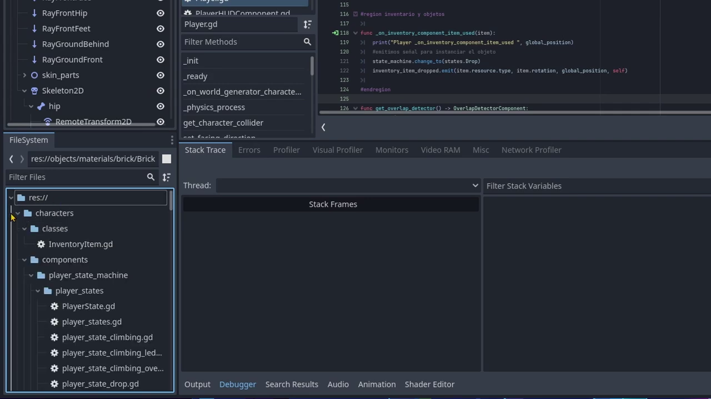
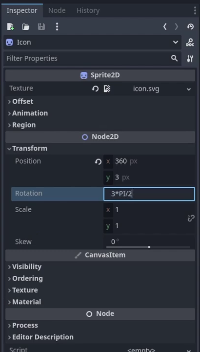
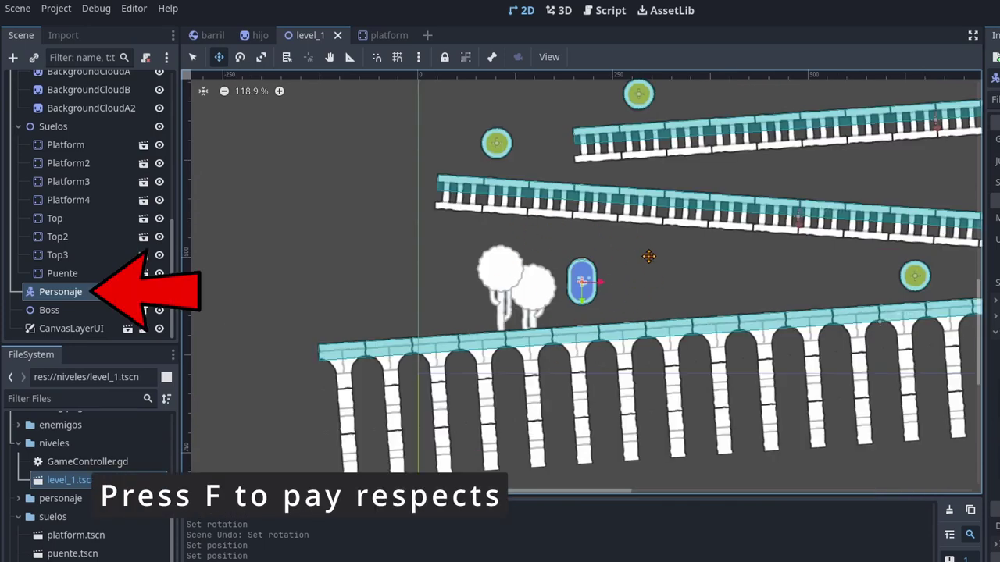
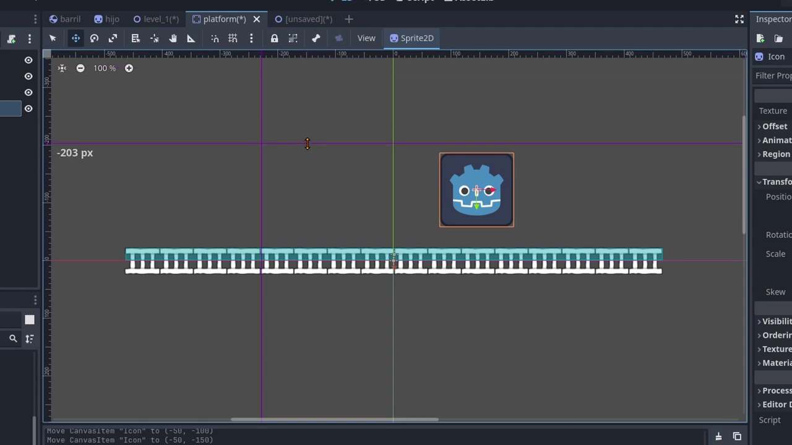
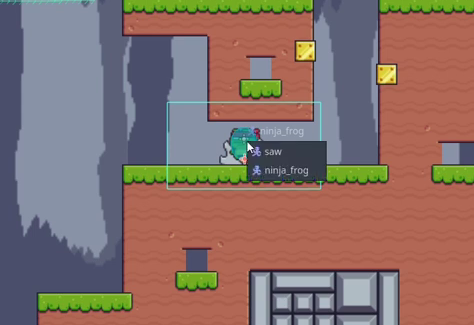

# Trucos de godot

## Nodos Favoritos
Puedes marcar un nodo como favorito para que aparezca en la sección de favoritos, facilitando su búsqueda.


Esto funciona tanto con nodos nativos como con los personalizados para tu juego.

Al crear un nuevo nodo, puedes seleccionarlo directamente desde la sección de favoritos y nodos personalizados, presionando el ícono de estrella.


## Desplegar y Colapsar
A veces, un nodo puede tener muchos nodos hijos, lo que puede hacer difícil encontrar uno en particular.

Para desplegar todos los nodos de un padre y sus subnodos, puedes presionar **Shift** + **Click**.


Para volver a colapsar, simplemente presiona **Shift** + **Click** de nuevo en el nodo padre.


Esto también funciona con los nodos hijos


Incluso en el explorador de archivos, permitiendo desplegar y colapsar directorios y subdirectorios para tener una visión general del proyecto.




## Anidamiento y posición
Si arrastras un nodo hacia otro nodo, este se anidará automáticamente, actualizando su ```Transform/Position``` para mantener su posición relativa al nuevo nodo padre.


Si presionas **Shift** mientras arrastras el nodo hijo hacia el padre, el nodo hijo conservará sus coordanada locales por lo que se moveraá dnetro de la esena y su ```Tranform/Position``` se mantiene.


## Asignar Scripts
Puedes asignar un script a un nodo usando el botón de asignar scripts, o simplemente arrastrando un archivo de script al nodo.


Si mantienes presionada la tecla **Ctrl** mientras arrastras el script, en lugar de adjuntarlo, se creará un subnodo con el script como componente.


## Arrastrar elementos

### Recursos

Podemos arrastar un recurso de un nodo hacia el panel de archivos


Podemos crear un archivo que guardará los valores del recurso


Esto espractico para si estas haciendo pruebas hasta encotrar el valor indicado para luego guradarlo, estos tfuncionará para los recurso nativos comolos persoanlizados.

### Nodos hijos

Si arrastramo un nodo hijo hacia algun directiorio en el panel de archivos.


Podemos guuardarel nodo hijo como una esena indepediente que se puede editar de manera autonoma y atomaticamente queda instaciado en el nodo padre.


El el panel de archivos si presionamos **Ctrl** mientrar arrastramos un archivo hacia otro directorio en vez de mover el archivo se creará una copia de ese archivo en otro directorio.

 

### Carpeta

Si arrastramos un archivo desde cualquier otro directorio en el dispositivo ese se copiara en la carpeta seleccianada.


En vez de instaciar una esena presionado la opcion de instanciar esena y seleccionar manulmente la esena, podemos ir al panel de archivos y buscar la esena arrartrarla hacia un nodo instaciandola de una manera rapida.

 

### Imagenes a Sprite2D
En vez de crear un Sprite manualmente podemos arrastrar una imagen a la esena se creará un nodo Sprite2D automaticamente (tambien posisicionado el Sprite en donde se arratró).

## Inpesctor de nodos

### Historial de cambios
En el inspector hay una seccion de historial que guarda las modificaciones del proyecto y podemos hacer click para regresar a algun cambio.


Pero tambien podemos usar atajos de teclados:

- Deshacer: **Ctrl** + **Z**
- Rehacer: **Ctrl** + **Shift** + **Z**

### Nodos duplicados

Cuando duplicamos un nodo podemos editar sus propiedades me manera indepediente como el ```Tranform/Position```:


Pero elementos complejos como los recusos está asignados por referencia, eso significa al ser mmodifcados tambien afectará al otro ya que utilizan el mismo recurso; esto puede ser util en caso de que necesites que el motor ahorre recursos


Pero si necesitas que utlicen propiedades diferentes en algun caso lo puedes hacer unico.


### Recordar el nodo
En caso de que se nos olvida el tipo de un nodo podemos ir al inspector de propiedades y mirar el tipo con los tipos heredados


Tambie podemos ir a la documentacion para saber mas detalles del tipo presionado al icono para la documentacion.


Yambien si Remonbras un nodo borrando todo el nombre, este recuperará el nombre de su clase.

### Evaluando expresiones
Podemos usar expresiones matematicas en el inspector de propiedades obtieniendo directamente los resultados

 

Tambien podemos usar constantes

 

O operaciones matematicas

 

### Midificacion mediante el foco

Si tenemos la propiedad en foco podemos presionar **Ctrl** y arrastramos el valor a la vez podemos seleccionar un valor.


Si presionamos **Click** + arrastrar el valor + **Shift** los incrementos seran más pequeños y precisos.


Si presionamos **Click** + arrastrar el valor + **Ctrl** los incrementos no usaran decimales, seran más grandes y en numeros enteros.


Tambien puedes unsar el teclado mediantes las flecha de arriba o abajo, lo que hará que el valor cambie de 1 a 1; Tambien puedes tener en cuenta los siguientes incremento o descrementos:

Imcrementos de:
- **Alt** + **Fecha Arriba/Abajo**: ±1.0

- **Fecha Arriba/Abajo**: ±1

- **Shift** + **Fecha Arriba/Abajo**: ±10

- **Ctrl** + **Fecha Arriba/Abajo**: ±100

## Editor de escenas

### Buscar nodo seleccionado
Si vamos al panel de esenas a seleccionar un nodo y presionamos **F** el editor de esena nos centrará en el foco el nodo en la geraquia de esenas.



### Bloquear ejes
Si movemos el nodo seleccionado y mantemos presionado **Shift** el nodo se mantedrá bloqueado en unos de sus ejes.

### Ecalar un nodo sin perde el centro
Normalmente cuando escalamos un nodo por ejemplo un CollisionChape2D este tambien desplazará su centro, entoces si queremos evitar esto podemos presionar **Alt** y Arrstramos el nodo se escalar de manera simetrica sin perder el centro


### Creacion de CollisionPolygon2D
Cunado estemos creando un poligono en vez de forma basica podemos presionar el boton de retroceso
**Backspace** para borrar el ultimo punto en caso de alguna equivocacion.

Si queremos cerraro más rapido podemos usar **Enter**.

### Snap y Grid
Si queremos una organixacion a la hora de crear la esena podemos configurar el Snap


Allí podemos configurar el Snaping


Luegos podemos darlea la opcion de mostrar cuadricula


Esto mostrará la cuadricula y el editor de esenas nos ayudara a alinear el nodo que estmos moviendo


### Mover un nodo mediante el teclado
Cuando tengamos un nodo seleccionado y presionamos **Shift** + unasde las flecha del teclado y tambien tendra en cuenta la distancia de la configuracion del grid.

### Smart Snaping
Si presionamos la tecla **Ctrl** y arrastramo el nodo se habilitará el Smart Snaping, que alinenará el nodo despecto a otros o ajustalo las guias.


### Añadir guias
Para añadir guias podemos arrastrarlas desde las reglas



Las cuales puede se util para alinear elemenetos como la intefaz

### Mover un nodo en especifico
Si queremos seleccionar una esena en especifica para moverla y como el nodo que está en cima por ejemplo, presione la tecla **Alt** y podemos seleccionar la esena mover.




## Editor de Scripts

### Editor de esenas y Scrips separados
Si presionamos al icono de **Make the scrip edito flotating**


Poodemos hace que el editor de scrips esté en una ventana aparte


### Depurar en otra ventana
En en editor settings Windows placement screen puedes decirle que cuando ejecutes el juego se abrá en otro monitor.


Así no te estorbar encima así no te estorbar encima.

### Arrastrar elemento al editor

Obtener la ruta de un nodo respecto a otro basta con arrastrar el nodo del que quieras la referencia al Script del nodo donde quieras usarlo por un lado


Esto te permite conocer su ruta pero gracias a este símbolo de ```$``` funciona directamente como una referencia que puedes utilizar para acceder a sus métodos y propiedades


Si arrastras un fichero desde el panel de ficheros hasta la ventana de Script obtendrás Igualmente la ruta de ese fichero

 

Pero si lo arrastras de la misma forma manteniendo pulsado **Ctrl** se creará automáticamente toda la línea donde se hace el preload de ese fichero y lo guarda en una variable para dejarlo cargado en memoria y listo para que lo uses donde necesites.


Si en lugar de arrastrar un fichero lo que arrastramos es un nodo de desde la jerarquía ocurrirá algo parecido en este caso toda la línea que necesitas para guardar la referencia a ese nodo en una variable que se asignará cuando ese nodo esté preparado para ser usado gracias a la palabra clave ```@onready```.


Puedes arrastrar de esta forma tantos ficheros como quieras.


### El simbolo procentaje (%)
Si tienes muchos nodos anidados a veces las rutas de las referencias pueden ser muy largas.


Puedes decirle que uses su nombre como una referencia única en esta escena


si haces esto aparecerá este símbolo de ```%```.


ahora escribiendo ```%``` y su nombre en lugar de dólar y su ruta accederás al mismo nodo pero de una forma mucho más corta y fácil.


### Marcadores de codigo
Cuando tengas un código muy largo a veces te costará encontrar partes importantes del código cuando estés navegando por él pero si quieres puedes poner marcadores pulsando **Shift** + click en la línea que quieras.


Aparecerán en el menú de marcadores de ese Script y podrás volver a ellos al instante


Si quieres darle un nombre puedes poner estos marcadores en una línea junto a un comentario y te será más fácil identificarlos.


### Regiones
Puedes organizar el código con la palabra clave ```#region``` junto a un texto que le das como título y un ```#end region``` al final.


estos comentarios especiales no hacen nada pero te permitirán colapsar partes del código para poder agrupar las cosas y hacer que todo tu Script sea más fácil de leer


Esto recuerda a C# en la que esposible esta sintaxiss

### Uso de Multicursor
Puedes usar el multicursor para editar varias líneas a la vez. Para activar el multicursor, presiona **Alt** + **Click** en los lugares donde desees crear cursores adicionales.


También puedes usar **Ctrl** + **Shift** y las teclas de flecha para seleccionar múltiples líneas.


### Evaluando expresiones
Al igual que el inspector el editor de scripts de Godot puede evaluar expresiones matemáticas. Puedes escribir cualquier cálculo y luego presionar **Ctrl** + **Shift** + **E** para evaluarlo y reemplazarlo con el resultado.


Al acabar seleccionarlo y pulsar **Ctrl** + **Shift** + **E** para evaluarlo y dejar únicamente el resultado.


### Comentarios Múltiples
Para comentar o descomentar varias líneas a la vez, selecciona las líneas y presiona **Ctrl** + **K**.


### Reemplazar los espacios por tabulcaiones
Puedes reemplazar los espacios de las sangrías por tabulaciones cuando copias código de internet a veces la sangría viene con espacios en lugar de con tabulaciones en GDScript puedes usar ambos pero no puedes mezclarlos en el mismo Script por lo que te aparecerá un error.


Puedes suerte resolverlo pulsando **Ctrl** + **I** y las sangrías con espacios se transformarán en tabulaciones al instante


