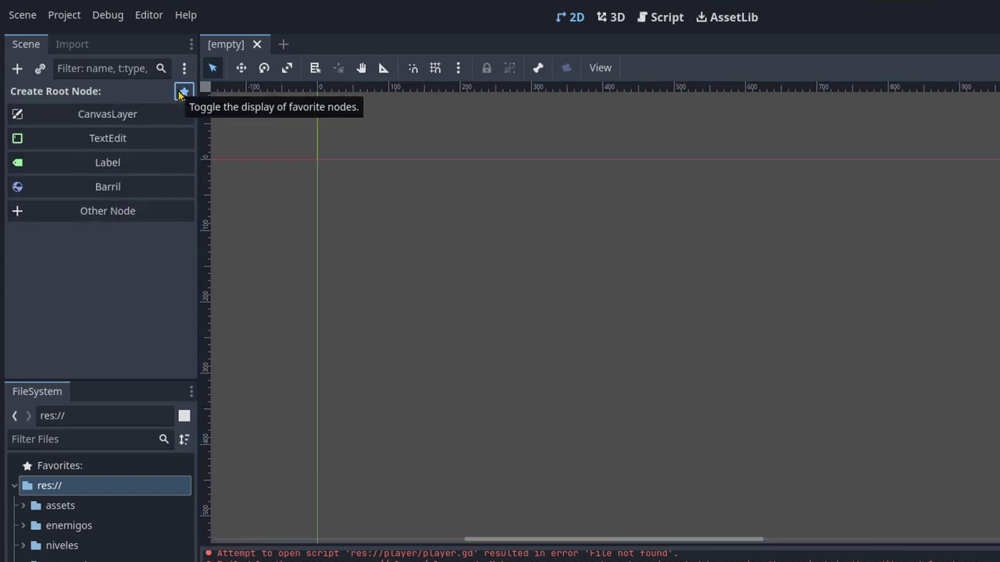
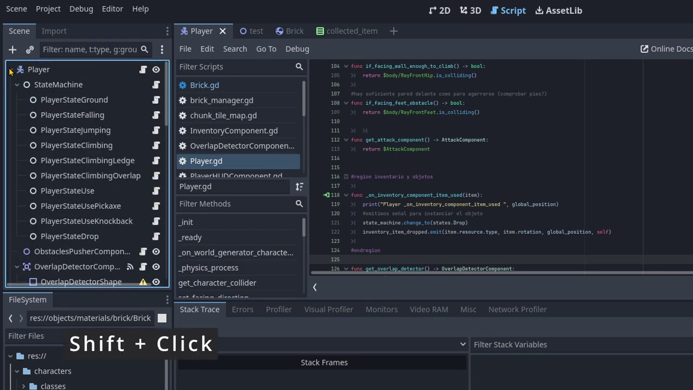
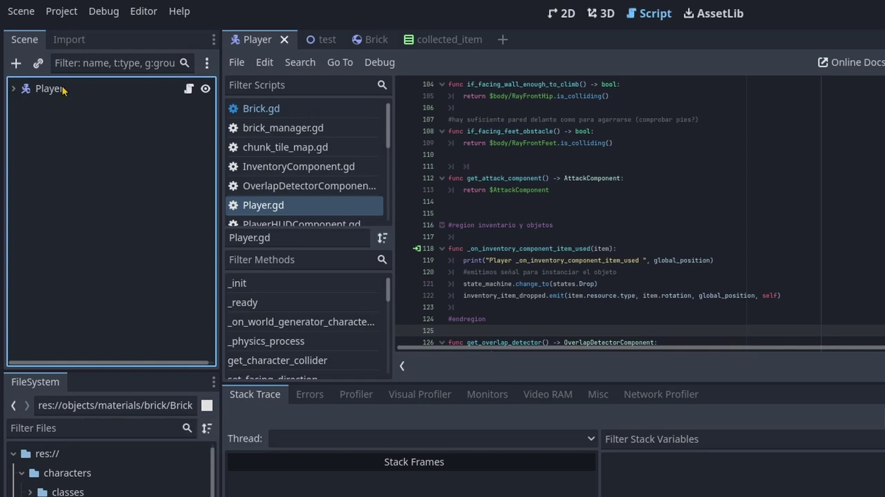
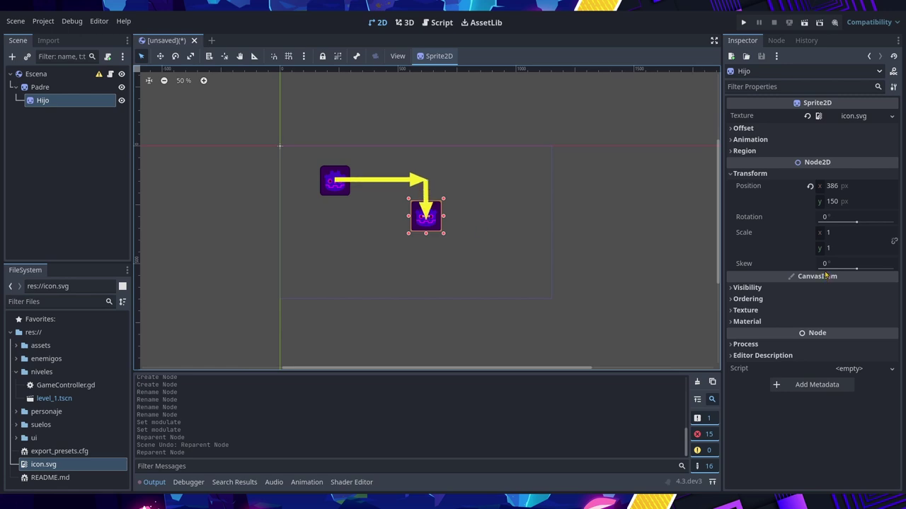
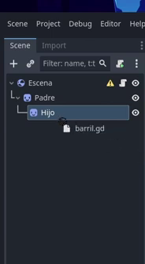
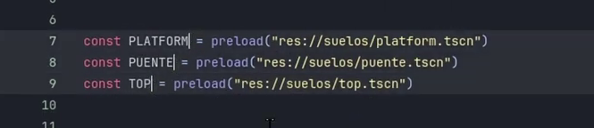
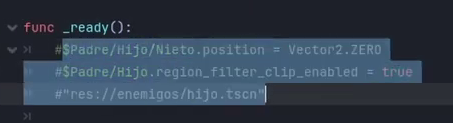
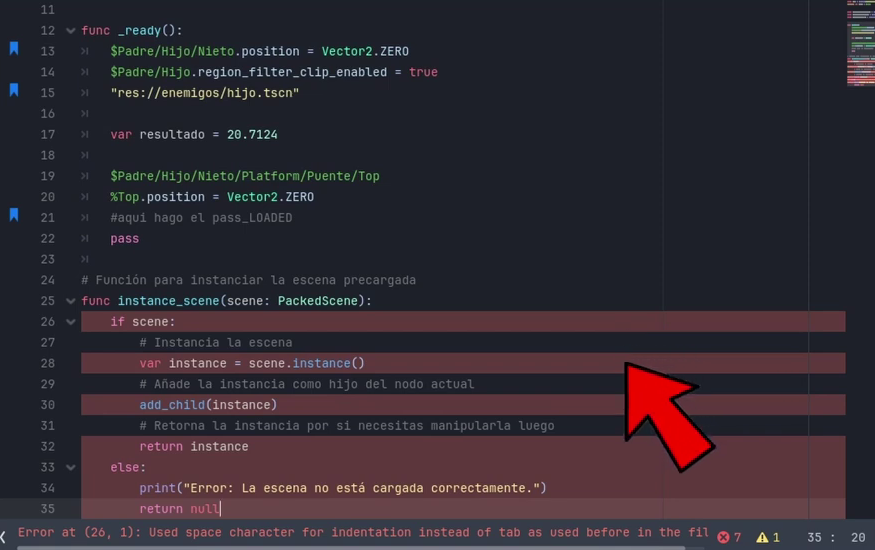

# Trucos de Godot

## Nodos Favoritos
Puedes marcar un nodo como favorito para que aparezca en la sección de favoritos, facilitando su búsqueda.


Esto funciona tanto con nodos nativos como con los personalizados para tu juego.

Al crear un nuevo nodo, puedes seleccionarlo directamente desde la sección de favoritos y nodos personalizados, presionando el ícono de estrella.



## Desplegar y Colapsar
A veces, un nodo puede tener muchos nodos hijos, lo que puede hacer difícil encontrar uno en particular.

Para desplegar todos los nodos de un padre y sus subnodos, puedes presionar **Shift** + **Click**.



Para volver a colapsar, simplemente presiona **Shift** + **Click** de nuevo en el nodo padre.



Esto también funciona con los nodos hijos y en el explorador de archivos, permitiendo desplegar y colapsar directorios y subdirectorios para tener una visión general del proyecto.


## Anidamiento y Posición
Si arrastras un nodo hacia otro nodo, este se anidará automáticamente, actualizando su ```Transform/Position``` para mantener su posición relativa al nuevo nodo padre.



Si presionas **Shift** mientras arrastras el nodo, el nodo hijo conservará sus coordenadas locales, manteniéndose en su lugar en la escena.


## Asignar Scripts
Puedes asignar un script a un nodo usando el botón de asignar scripts, o simplemente arrastrando un archivo de script al nodo.



Si mantienes presionada la tecla **Ctrl** mientras arrastras el script, en lugar de adjuntarlo, se creará un subnodo con el script como componente.


## Evaluación de Expresiones
El editor de scripts de Godot puede evaluar expresiones matemáticas. Puedes escribir cualquier cálculo y luego presionar **Ctrl** + **Shift** + **E** para evaluarlo y reemplazarlo con el resultado.


## Uso de Multicursor
Puedes usar el multicursor para editar varias líneas a la vez. Para activar el multicursor, presiona **Alt** + **Click** en los lugares donde desees crear cursores adicionales.



También puedes usar **Ctrl** + **Shift** y las teclas de flecha para seleccionar múltiples líneas.

## Comentarios Múltiples
Para comentar o descomentar varias líneas a la vez, selecciona las líneas y presiona **Ctrl** + **K**.



## Reemplazar Espacios por Tabulaciones
Si copias código de internet y las sangrías están hechas con espacios en lugar de tabulaciones, puedes convertir los espacios en tabulaciones presionando **Ctrl** + **I**.



Recuerda que en GDScript, no puedes mezclar espacios y tabulaciones en el mismo script, ya que causará errores de indentación.
